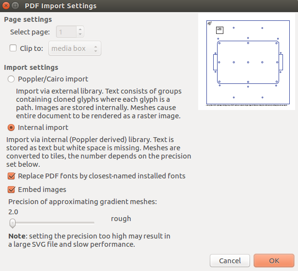

Generated by opening the pre-existing `*.ai` files in Inkscape verseion
`0.92.5+68`, and using the following import settings:

Then I tried to change the stroke width of all relevant lines to 1.0 px, just to
be able to see them for now. Often need to change color + thickness when about
to lasercut, so lasercutter recognizes the lines as to-be-cut.
